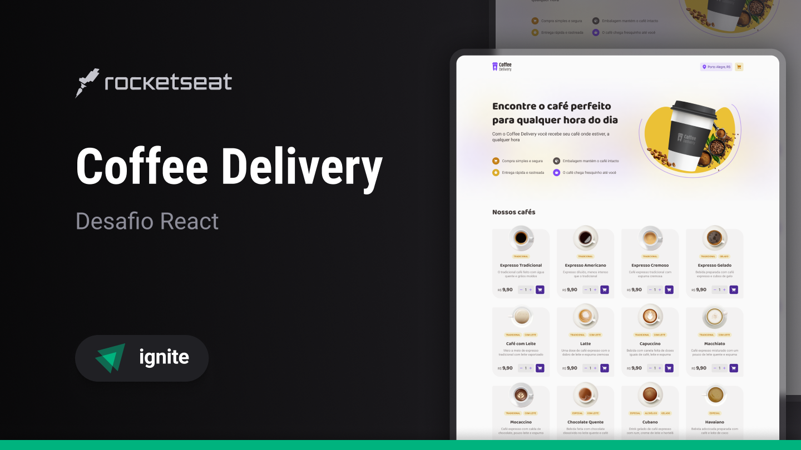

<h1 align="center">
  
</h1>

<p align="center">Ignite | ReactJS - Desafio Coffee Delivery</p>

<p align="center">
  <a href="#-projeto">Projeto</a>&nbsp;&nbsp;&nbsp;|&nbsp;&nbsp;&nbsp;
  <a href="#-tecnologias">Tecnologias</a>&nbsp;&nbsp;&nbsp;|&nbsp;&nbsp;&nbsp;
  <a href="#-como-executar">Como Executar</a>&nbsp;&nbsp;&nbsp;|&nbsp;&nbsp;&nbsp;
  <a href="#-licença">Licença</a>&nbsp;&nbsp;&nbsp;|&nbsp;&nbsp;&nbsp;
  <a href="#-autor">Autor</a>
</p>

<p align="center">
  <a href="https://github.com/jordane-chaves/food-explorer-frontend/blob/main/LICENSE">
    
  </a>
</p>

## 💻 Projeto

**Coffee Delivery** é uma página web de catálogo e compra de cafés.

Esse projeto é um dos desafios da trilha ReactJS da [Rocketseat](https://www.rocketseat.com.br/).

<p align="center">
  
</p>

## 🚀 Tecnologias

Esse projeto foi desenvolvido com as seguintes tecnologias:

- [TypeScript](https://www.typescriptlang.org/)
- [ReactJS](https://react.dev/)
- [Styled Components](https://styled-components.com/)
- [React Router Dom](https://reactrouter.com/)
- [Vite](https://vitejs.dev/)
- [Zod](https://zod.dev/)
- [React Hook Form](https://www.react-hook-form.com/)

## 🎲 Como executar

```bash
# Clone este repositório
$ git clone https://github.com/jordane-chaves/challenge-02-ignite-coffee-delivery

# Acesse o diretório do projeto no terminal/cmd
$ cd challenge-02-ignite-coffee-delivery

# Instale as dependências
$ npm install

# Execute a aplicação em modo de desenvolvimento
$ npm run dev

# A aplicação inciará na porta:5173 - acesse <http://localhost:5173>
```

## 📝 Licença

Esse projeto está sob a licença MIT - veja o arquivo [LICENSE](https://github.com/jordane-chaves/challenge-02-ignite-coffee-delivery/blob/main/LICENSE) para mais detalhes.

## 👨🏻‍💻 Autor


Feito com 💜 por Jordane Chaves